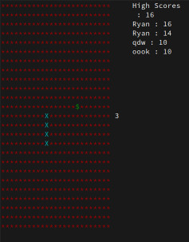

# Snake

Snake implementation in C using ncurses

I would have liked to decouple the graphical code from the logic, however there is only two instances where graphics functions
are called from Snake. The reason I kept it like this is because ncurses allows me to only update what has changed since
the last refresh, so by calling the graphics functions within the logic code makes it so I don't have to loop through
the world(2D array) to see what has changed.

The snake is represented as a linked list. Movement is achieved by adding a head node with x-y coordinates of the new
position in world. If the new x-y coordinate contains food, then the tail of the linked list is not deleted. Otherwise
it's deleted. This way of doing movement is really nice (especially with how ncurses works) because I never have to iterate
through the entire linked list updating the position of each node, I just have to update the head and tail nodes.

**TO-DO**
* Segment display into ncurses windows
* Fix movement bug where player can do a 180 and run into themselves
